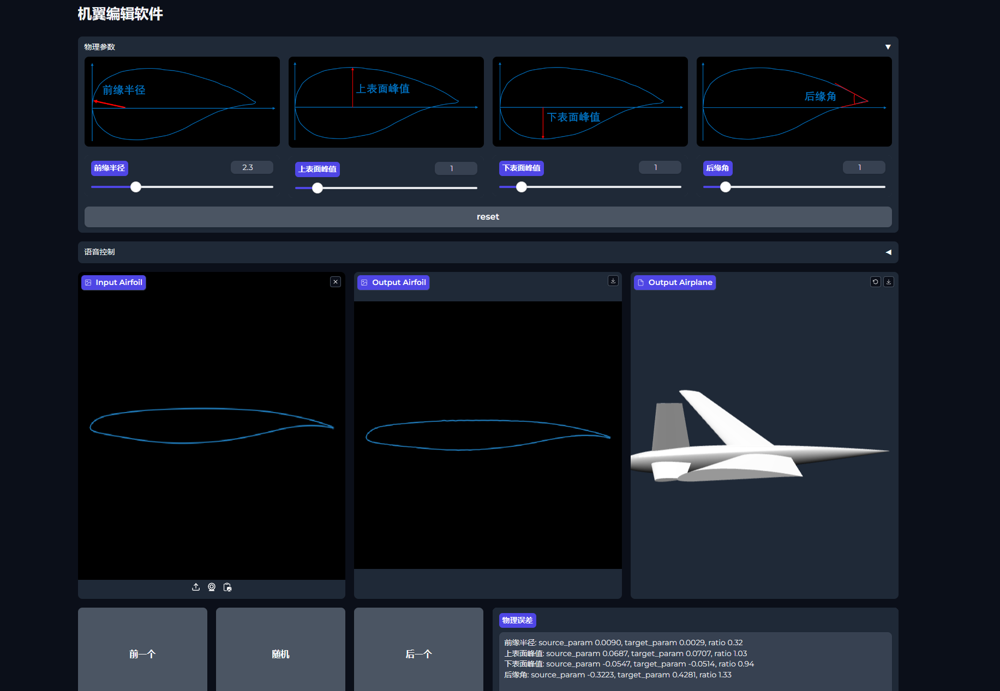

# airfoil-demo

Editing keypoint &amp; parameters, built upon [gradio](https://www.gradio.app/)

<p align="center">
  
</p>

## Installation

```bash
conda create --name airfoil python=3.8
conda activate airfoil
pip install -r requirements.txt
```

## Dataset

请将数据集存放在 `data` 文件夹下, 默认数据集为 `data/airfoil/supercritical_airfoil/*.dat`

## Usage

在项目的根文件夹下:

```bash
# Start Editing using CVAE
python demo_cvae.py

# Start Editing using Diffusion
python demo_diffusion.py
```
